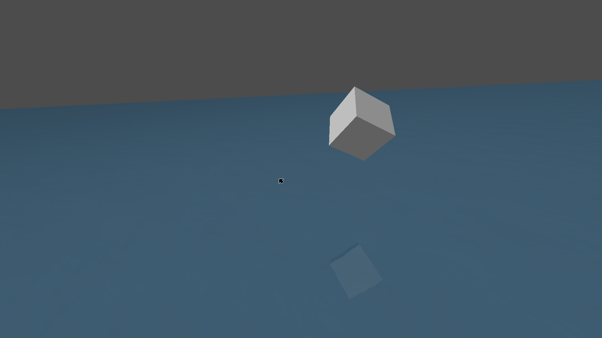
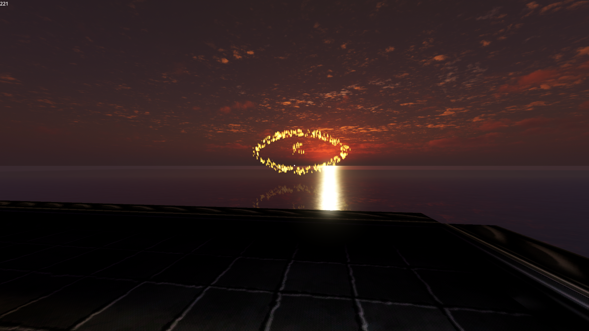
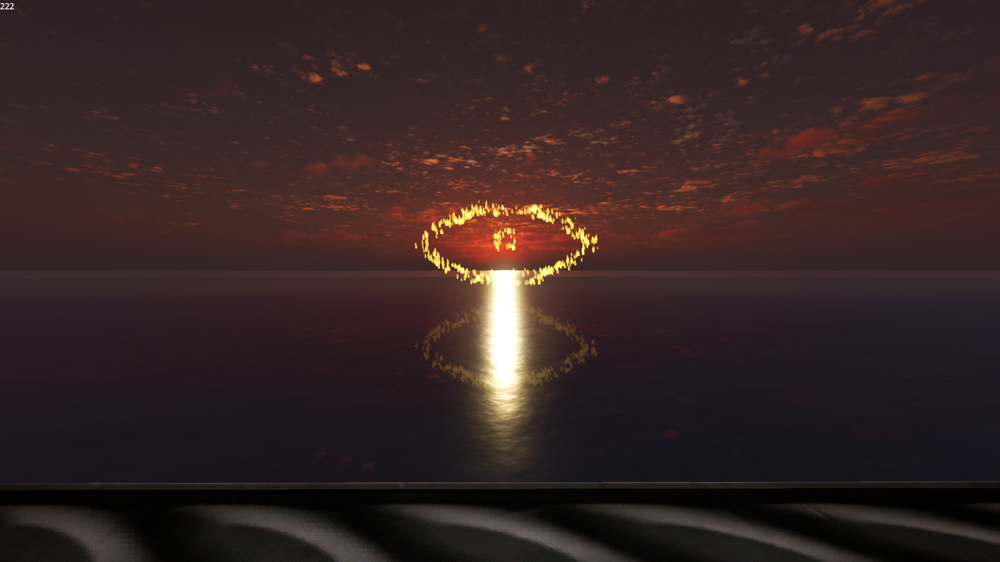

# gd_planar_reflections
## Motive

Godot has screenspace reflections and similar solutions but no planar reflections. This exists to fix that.

## Eye candy

## Use
Your planar reflections node will have 2 parameters. One for the camera and one for the resolution of the reflected view.

Please see the example scene as an example of this.

Additionally this is set up to be like water currently. As a result the shader has a lot of settings to distort it like water. Feel free to turn these down if you want a pure mirror, or turn them up if you want rippling water.

## FAQ

- Why is it pink in the editor?
  - So you know what is being reflected. Also because planar reflections involves rendering the scene twice, I didn't want to do that for the editor.
- How can I change how it looks?
  - Look at the shader script.
- Can I...?
  - Probably.

## Contributing/bugs

Feel free to raise issues or bugs as needed.
